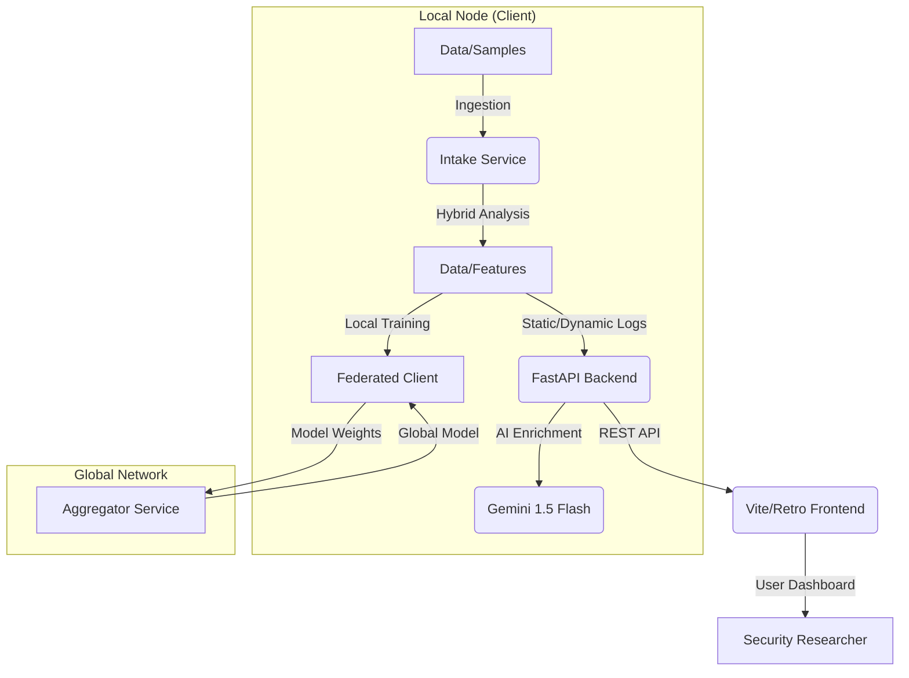

# Federated Threat Intelligence (FTI)

Federated Threat Intelligence (FTI) is a **modular hybrid malware analysis framework** designed for deep binary inspection and automated threat research. It combines static analysis using **radare2** with dynamic execution monitoring via **strace**, providing a comprehensive intelligence baseline enhanced by **Gemini-powered AI insights** and **Privacy-Preserving Federated Learning**.

FTI serves as a robust foundation for collaborative threat research, prioritizing reproducibility, clean architecture, and deterministic analysis.

---

## 🏗️ Architecture

FTI operates as a containerized microservices ecosystem, ensuring isolation and consistent performance across environments. The latest version introduces a **Federated Learning (FL)** layer for collaborative model training without sharing raw malware data.



---

## 🚀 Key Features

### 🔍 Hybrid Analysis Pipeline
- **Static Analysis**: Powered by **radare2** for reliable function discovery (`aflj`), metadata extraction (MD5, SHA1, SHA256), and entropy calculation.
- **Dynamic Analysis**: Automated execution monitoring using **strace** to capture system calls and observe runtime behavior.
- **Behavioral Risk Scoring**: Intelligent mapping of syscalls and function patterns to severity levels.

### 🌐 Collaborative Intelligence (Federated Learning)
- **Privacy-Preserving Training**: Train a global `FederatedRiskScorer` using **FedAvg (Federated Averaging)**.
- **Zero-Data Sharing**: Nodes share only model weights (gradient updates), keeping sensitive malware binaries and local analysis private.
- **Adaptive Scoring**: The local risk engine improves over time as it synchronizes with the global intelligence model.

### 🤖 AI-Powered Intelligence
- **Gemini Integration**: Automated threat summarization and contextual analysis of findings.
- **Smart Reports**: Generates concise, human-readable intelligence reports from complex technical data.
- **Downloadable Artifacts**: One-click export of AI-generated threat reports.

### 🖥️ Interactive Dashboard
- **Retro-Terminal UI**: A high-performance, Vite-powered web interface with a terminal aesthetic.
- **Real-Time Visualization**: Browse analyzed samples, run detailed scans, and view logs in an immersive console.
- **Live Monitoring**: Track analysis status and system health directly from the dashboard.

---

## 🛠️ Getting Started

### Prerequisites
- **Docker** & **Docker Compose**
- **Gemini API Key** (for AI features)

### One-Command Deployment
The easiest way to start the FTI stack is using the provided `start.sh` script:

```bash
chmod +x start.sh
./start.sh
```

Alternatively, run via Docker Compose:
```bash
docker compose up --build
```

The stack includes:
- `intake`: The core backend and analysis engine.
- `aggregator`: The central node for federated model aggregation.
- `frontend`: The retro-themed user interface.

### Accessing the Dashboard
Once the services are healthy, open your browser to:
**[http://localhost:3000](http://localhost:3000)**

---

## 📁 Data Structure

- `data/samples/`: Place your malware binaries here for analysis.
- `data/features/`: Persisted analysis results, including JSON metadata and AI reports.
- `data/global_models/`: Storage for the local and synchronized global federated models (`.npy` files).

---

## 🔌 API Reference (FastAPI)

The backend provides a comprehensive REST API at `http://localhost:8000`:

### Core Analysis
- `GET /samples`: List all processed samples.
- `GET /samples/{id}/summary`: Retrieve metadata and threat overview.
- `GET /samples/{id}/analysis/static/functions`: Get detailed function maps.
- `POST /samples/{id}/report`: Trigger Gemini AI report generation.

### Federated Learning
- `POST /federated/train`: Trigger a local training round and synchronize with the aggregator.
- `GET /federated/status`: Check local model availability and type.

---

## 🧪 Design Principles
- **Isolation**: All analysis occurs within Docker containers for host safety.
- **Privacy**: Federated Learning ensures collaborative intelligence without data exposure.
- **Extensibility**: Modular extractor system for adding new analysis layers.

---

## ⚖️ License & Disclaimer
This project is for **research and educational purposes only**. Handling malware carries inherent risks. Users are responsible for ensuring compliance with all local and international laws.
